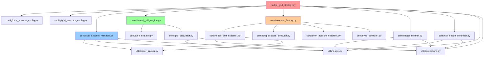
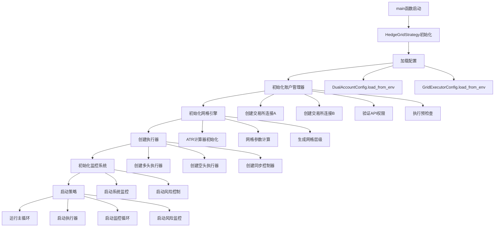
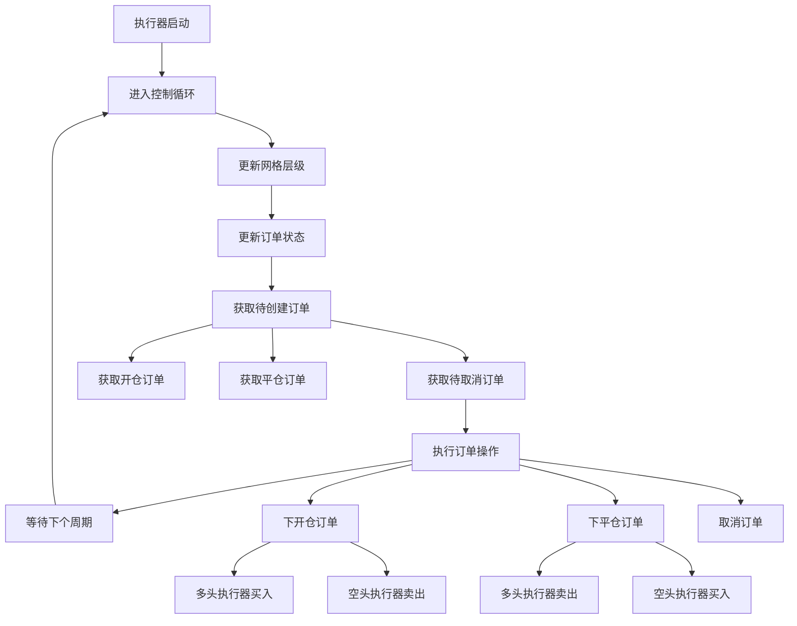
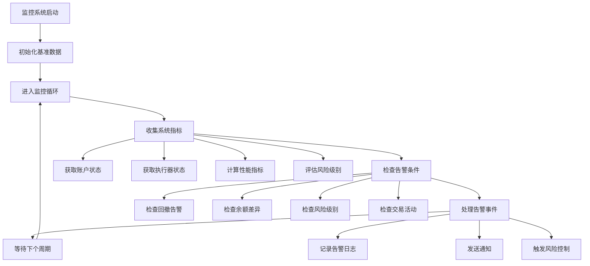
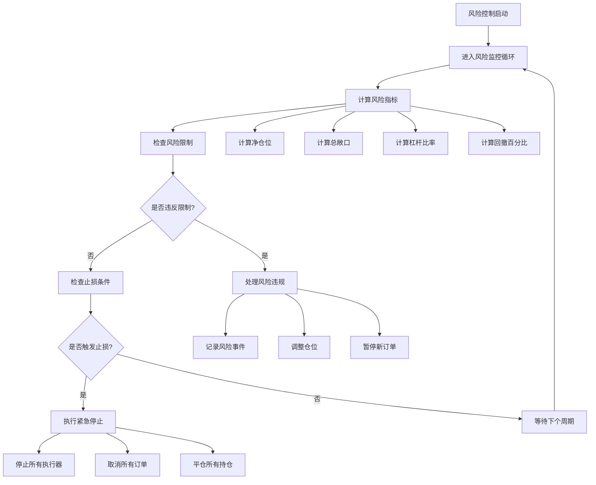

# 双账户对冲网格策略 - 函数调用关系分析

## 📋 项目概述

本项目是一个基于Python的双账户对冲网格交易策略系统，采用模块化设计，具有清晰的分层架构。

## 🏗️ 系统架构层次

```
双账户对冲网格策略系统
├── 主策略层 (hedge_grid_strategy.py)
├── 配置管理层 (config/)
├── 账户管理层 (core/dual_account_manager.py)
├── 网格计算层 (core/atr_calculator.py, grid_calculator.py, shared_grid_engine.py)
├── 执行器架构层 (core/hedge_grid_executor.py, long/short_account_executor.py)
├── 监控管理层 (core/hedge_monitor.py, risk_hedge_controller.py)
└── 工具库层 (utils/)
```

## 🔑 核心函数识别

### 1. 主要入口函数

| 函数名 | 位置 | 作用 | 重要性 |
|--------|------|------|--------|
| `main()` | hedge_grid_strategy.py | 系统主入口点，协调所有模块初始化和运行 | ⭐⭐⭐⭐⭐ |
| `HedgeGridStrategy.main()` | hedge_grid_strategy.py | 策略主控制流程 | ⭐⭐⭐⭐⭐ |
| `initialize_system()` | hedge_grid_strategy.py | 系统组件初始化 | ⭐⭐⭐⭐ |
| `start_strategy()` | hedge_grid_strategy.py | 启动策略执行 | ⭐⭐⭐⭐ |

### 2. 关键工具函数和辅助函数

| 函数名 | 位置 | 作用 | 重要性 |
|--------|------|------|--------|
| `DualAccountManager.initialize_accounts()` | core/dual_account_manager.py | 初始化双账户连接 | ⭐⭐⭐⭐ |
| `SharedGridEngine.initialize_grid_parameters()` | core/shared_grid_engine.py | 初始化网格参数 | ⭐⭐⭐⭐ |
| `ExecutorFactory.create_executors()` | core/executor_factory.py | 创建执行器实例 | ⭐⭐⭐ |
| `HedgeGridExecutor.control_loop()` | core/hedge_grid_executor.py | 执行器主控制循环 | ⭐⭐⭐⭐ |
| `SyncController.start_hedge_strategy()` | core/sync_controller.py | 启动双账户同步策略 | ⭐⭐⭐⭐ |

### 3. 监控和风险控制函数

| 函数名 | 位置 | 作用 | 重要性 |
|--------|------|------|--------|
| `HedgeMonitor.start_monitoring()` | core/hedge_monitor.py | 启动系统监控 | ⭐⭐⭐ |
| `RiskHedgeController.start_risk_monitoring()` | core/risk_hedge_controller.py | 启动风险监控 | ⭐⭐⭐ |
| `collect_metrics()` | core/hedge_monitor.py | 收集监控指标 | ⭐⭐ |
| `calculate_risk_metrics()` | core/risk_hedge_controller.py | 计算风险指标 | ⭐⭐⭐ |

## 🔄 调用链路分析

### 主要调用流程

```
main() [hedge_grid_strategy.py]
├── HedgeGridStrategy.__init__()
├── HedgeGridStrategy.main()
    ├── setup_signal_handlers()
    ├── initialize_system()
    │   ├── _load_configurations()
    │   │   ├── DualAccountConfig.load_from_env()
    │   │   └── GridExecutorConfig.load_from_env()
    │   ├── _initialize_account_manager()
    │   │   └── DualAccountManager.initialize_accounts()
    │   │       ├── _initialize_single_account() [A账户]
    │   │       ├── _initialize_single_account() [B账户]
    │   │       └── _update_account_status()
    │   ├── _initialize_grid_engine()
    │   │   └── SharedGridEngine.initialize_grid_parameters()
    │   │       ├── ATRCalculator.calculate_atr_channel()
    │   │       ├── GridCalculator.calculate_grid_parameters()
    │   │       └── generate_grid_levels()
    │   ├── _create_executors()
    │   │   └── ExecutorFactory.create_executors()
    │   │       ├── create_dual_account_strategy()
    │   │       │   ├── LongAccountExecutor.__init__()
    │   │       │   ├── ShortAccountExecutor.__init__()
    │   │       │   └── SyncController.__init__()
    │   │       └── create_single_account_strategy()
    │   ├── _initialize_monitoring()
    │   │   ├── HedgeMonitor.__init__()
    │   │   └── RiskHedgeController.__init__()
    │   └── _initialize_risk_control()
    ├── start_strategy()
    │   ├── HedgeMonitor.start_monitoring()
    │   ├── RiskHedgeController.start_risk_monitoring()
    │   └── SyncController.start_hedge_strategy()
    │       ├── LongAccountExecutor.start()
    │       ├── ShortAccountExecutor.start()
    │       ├── sync_monitoring_loop()
    │       └── risk_monitoring_loop()
    ├── run_main_loop()
    └── shutdown_strategy()
```

### 执行器控制循环

```
HedgeGridExecutor.control_loop()
├── _update_grid_levels()
├── _update_order_status()
├── get_open_orders_to_create()
├── get_close_orders_to_create()
├── _get_orders_to_cancel()
└── execute_order_operations()
    ├── _place_open_order() [抽象方法]
    ├── _place_close_order() [抽象方法]
    └── _cancel_order()
```

### 监控循环

```
HedgeMonitor._monitoring_loop()
├── collect_metrics()
│   ├── DualAccountManager.get_dual_account_status()
│   ├── HedgeGridExecutor.get_status()
│   └── 计算性能指标
├── check_alerts()
└── _process_alerts()

RiskHedgeController._risk_monitoring_loop()
├── calculate_risk_metrics()
├── check_risk_limits()
├── should_trigger_stop_loss()
└── emergency_shutdown()
```

## 🔗 模块间依赖关系

### Import依赖图



## 📊 函数重要性排序

### 按重要性排序的函数列表

1. **系统级核心函数** (⭐⭐⭐⭐⭐)
   - `main()` - 系统入口点
   - `HedgeGridStrategy.main()` - 主控制流程
   - `initialize_system()` - 系统初始化

2. **业务核心函数** (⭐⭐⭐⭐)
   - `DualAccountManager.initialize_accounts()` - 账户初始化
   - `SharedGridEngine.initialize_grid_parameters()` - 网格参数初始化
   - `HedgeGridExecutor.control_loop()` - 执行器主循环
   - `SyncController.start_hedge_strategy()` - 同步策略启动
   - `start_strategy()` - 策略启动

3. **功能支持函数** (⭐⭐⭐)
   - `ExecutorFactory.create_executors()` - 执行器创建
   - `HedgeMonitor.start_monitoring()` - 监控启动
   - `RiskHedgeController.start_risk_monitoring()` - 风险监控启动
   - `calculate_risk_metrics()` - 风险指标计算
   - `DualAccountManager.pre_flight_checks()` - 预检查

4. **工具辅助函数** (⭐⭐)
   - `collect_metrics()` - 指标收集
   - `ATRCalculator.calculate_atr_channel()` - ATR计算
   - `GridCalculator.calculate_grid_parameters()` - 网格参数计算
   - `OrderTracker.add_order()` - 订单跟踪

5. **配置和工具函数** (⭐)
   - `DualAccountConfig.load_from_env()` - 配置加载
   - `setup_logger()` - 日志设置
   - `round_to_precision()` - 精度处理
   - `validate_trading_pair()` - 交易对验证

## 🔄 循环调用和递归关系

### 主要循环调用

1. **主运行循环**
   - `run_main_loop()` → `_log_status_summary()` → 循环等待

2. **执行器控制循环**
   - `control_loop()` → 订单处理 → `asyncio.sleep()` → 循环

3. **监控循环**
   - `_monitoring_loop()` → `collect_metrics()` → `check_alerts()` → 循环
   - `_risk_monitoring_loop()` → `calculate_risk_metrics()` → `check_risk_limits()` → 循环

4. **同步控制循环**
   - `sync_monitoring_loop()` → `check_sync_status()` → 循环
   - `risk_monitoring_loop()` → `check_hedge_risk()` → 循环

### 递归关系

- **错误重试机制**: 大部分异步函数都包含错误处理和重试逻辑
- **状态更新链**: `_update_account_status()` → `get_dual_account_status()` → 状态传播

## 🔧 紧耦合和松耦合分析

### 紧耦合部分
- `HedgeGridStrategy` 与所有核心模块紧密耦合
- `DualAccountManager` 与交易所API紧密耦合
- 执行器与网格引擎紧密耦合

### 松耦合部分
- 配置管理模块独立性强
- 工具函数库完全独立
- 监控模块相对独立
- 异常处理系统独立

## 📈 异步调用模式

系统大量使用异步编程模式：
- 所有核心业务函数都是异步函数
- 使用`asyncio.create_task()`创建并发任务
- 使用`asyncio.sleep()`实现非阻塞等待
- 使用`async with`进行资源管理

## 🛡️ 错误处理机制

- 分层异常处理：每层都有对应的异常类型
- 统一错误记录：通过logger记录所有错误
- 优雅降级：关键错误触发紧急停止机制
- 重试机制：网络相关操作具备重试能力

## 📊 详细调用关系图表

### 系统初始化流程图



### 执行器运行流程图



### 监控系统流程图



### 风险控制流程图



## 🔧 关键函数详细分析

### 1. 系统初始化函数

**`initialize_system()` 调用链:**
```
initialize_system()
├── _load_configurations()
│   ├── DualAccountConfig.load_from_env()
│   └── GridExecutorConfig.load_from_env()
├── _initialize_account_manager()
│   └── DualAccountManager.initialize_accounts()
│       ├── _initialize_single_account('A')
│       ├── _initialize_single_account('B')
│       ├── _check_api_permissions()
│       └── pre_flight_checks()
├── _initialize_grid_engine()
│   └── SharedGridEngine.initialize_grid_parameters()
│       ├── ATRCalculator.calculate_atr_channel()
│       ├── GridCalculator.calculate_grid_parameters()
│       └── generate_grid_levels()
├── _create_executors()
│   └── ExecutorFactory.create_executors()
├── _initialize_monitoring()
│   ├── HedgeMonitor.__init__()
│   └── RiskHedgeController.__init__()
└── _initialize_risk_control()
```

### 2. 账户管理核心函数

**`DualAccountManager.initialize_accounts()` 调用链:**
```
initialize_accounts()
├── _initialize_single_account('A')
│   ├── 创建ccxt交易所实例
│   ├── load_markets()
│   ├── fetch_balance()
│   └── _check_api_permissions()
├── _initialize_single_account('B')
│   ├── 创建ccxt交易所实例
│   ├── load_markets()
│   ├── fetch_balance()
│   └── _check_api_permissions()
└── _update_account_status()
    ├── fetch_positions()
    ├── fetch_open_orders()
    └── 更新AccountStatus
```

### 3. 网格引擎核心函数

**`SharedGridEngine.initialize_grid_parameters()` 调用链:**
```
initialize_grid_parameters()
├── ATRCalculator.calculate_atr_channel()
│   ├── fetch_ohlcv()
│   ├── calculate_true_range()
│   ├── calculate_atr()
│   └── calculate_channel_bounds()
├── GridCalculator.calculate_grid_parameters()
│   ├── calculate_grid_spacing()
│   ├── calculate_grid_levels()
│   └── calculate_position_sizes()
└── generate_grid_levels()
    ├── 生成多头网格层级
    └── 生成空头网格层级
```

### 4. 执行器核心函数

**`HedgeGridExecutor.control_loop()` 调用链:**
```
control_loop()
├── _update_grid_levels()
│   └── SharedGridEngine.get_current_grid_data()
├── _update_order_status()
│   ├── fetch_open_orders()
│   └── OrderTracker.update_order_status()
├── get_open_orders_to_create()
│   ├── _get_current_price()
│   └── _should_place_order_at_level()
├── get_close_orders_to_create()
│   └── 检查已成交订单
├── _get_orders_to_cancel()
│   └── 检查过期订单
└── execute_order_operations()
    ├── _place_open_order() [抽象方法]
    ├── _place_close_order() [抽象方法]
    └── _cancel_order()
```

## 📈 性能关键路径

### 高频调用路径
1. **订单处理路径**: `control_loop()` → `execute_order_operations()` → 交易所API
2. **状态更新路径**: `_update_order_status()` → `fetch_open_orders()` → 状态同步
3. **价格获取路径**: `_get_current_price()` → `fetch_ticker()` → 价格判断

### 资源密集型操作
1. **网格参数计算**: ATR计算和网格层级生成
2. **账户状态同步**: 双账户余额和持仓查询
3. **风险指标计算**: 实时风险评估和监控

## 🔄 异步并发模式

### 主要并发任务
```python
# 主要异步任务创建模式
self._monitor_task = asyncio.create_task(self._monitoring_loop())
self._risk_task = asyncio.create_task(self._risk_monitoring_loop())
self._sync_task = asyncio.create_task(self.sync_monitoring_loop())
self._health_check_task = asyncio.create_task(self.health_check_loop())
```

### 同步控制机制
- **连接锁**: `async with self._connection_lock`
- **余额锁**: `async with self._balance_lock`
- **订单锁**: 防止订单操作冲突

## 🎯 优化建议

### 性能优化点
1. **缓存机制**: 价格数据和账户状态缓存
2. **批量操作**: 订单批量处理和状态批量更新
3. **连接池**: 交易所连接复用
4. **异步优化**: 减少不必要的await调用

### 架构改进点
1. **解耦合**: 减少模块间的直接依赖
2. **插件化**: 支持不同交易所的插件式接入
3. **配置热更新**: 支持运行时配置修改
4. **状态持久化**: 系统状态的持久化存储

## 📋 总结

### 系统特点
- **分层架构**: 清晰的6层架构设计，职责分离明确
- **异步驱动**: 全面采用asyncio异步编程模式
- **模块化设计**: 高内聚低耦合的模块组织
- **完善监控**: 实时监控和风险控制机制
- **容错处理**: 多层次的错误处理和恢复机制

### 关键调用路径
1. **系统启动**: `main()` → `initialize_system()` → `start_strategy()` → `run_main_loop()`
2. **订单执行**: `control_loop()` → `execute_order_operations()` → 交易所API
3. **监控告警**: `_monitoring_loop()` → `collect_metrics()` → `check_alerts()`
4. **风险控制**: `_risk_monitoring_loop()` → `calculate_risk_metrics()` → `emergency_shutdown()`

### 性能瓶颈
- **网络IO**: 交易所API调用是主要瓶颈
- **状态同步**: 双账户状态同步开销较大
- **指标计算**: 实时风险指标计算消耗CPU资源

### 扩展性
- **交易所支持**: 通过ccxt库支持多个交易所
- **策略扩展**: 执行器抽象设计支持不同策略
- **监控扩展**: 插件式监控指标和告警机制

### 维护性
- **日志完善**: 结构化日志记录所有关键操作
- **异常分类**: 细分的异常类型便于问题定位
- **测试覆盖**: 完整的单元测试覆盖
- **文档齐全**: 详细的代码注释和API文档

---

*本分析基于项目当前版本，随着代码演进可能需要更新*
